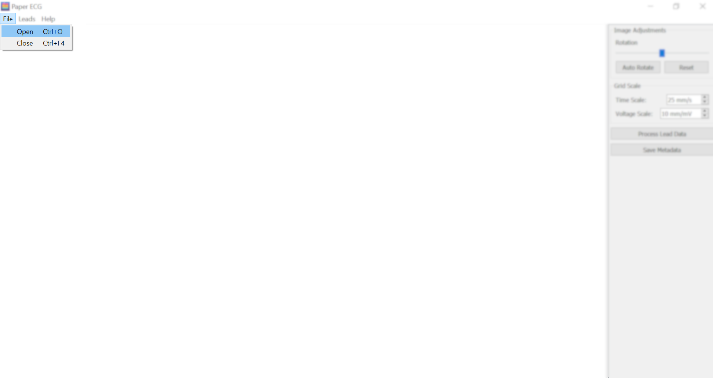
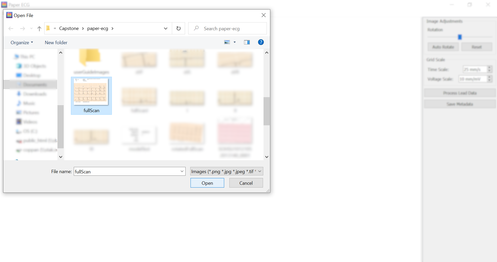
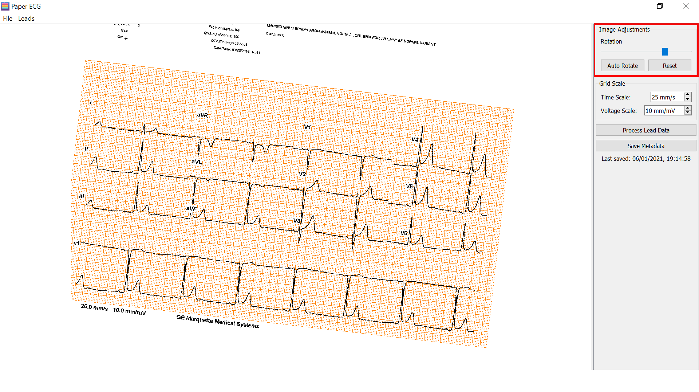
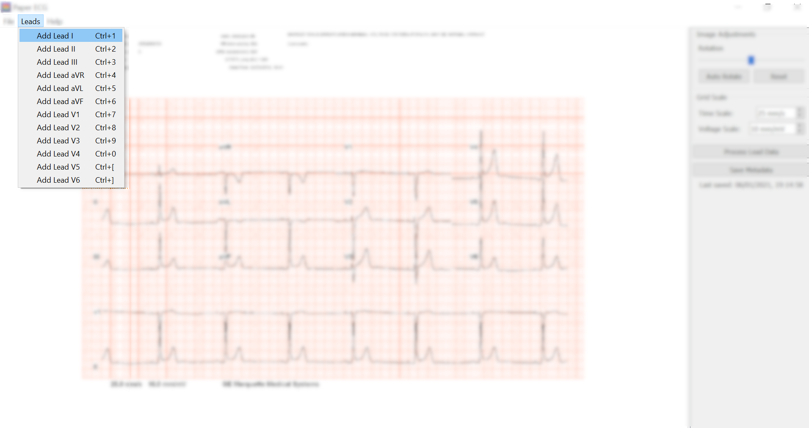
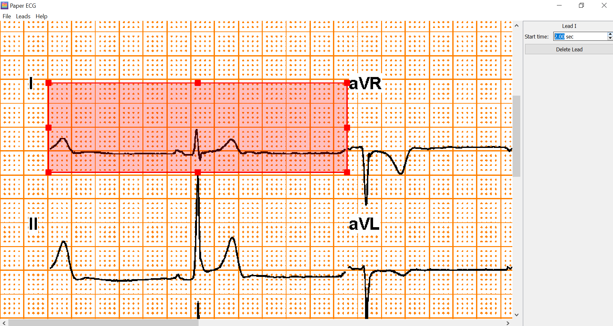
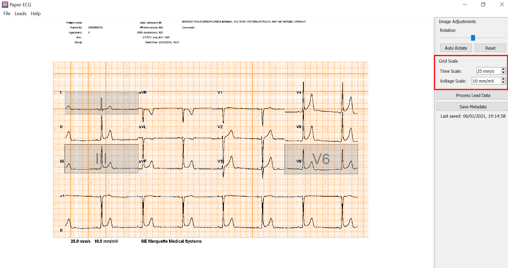
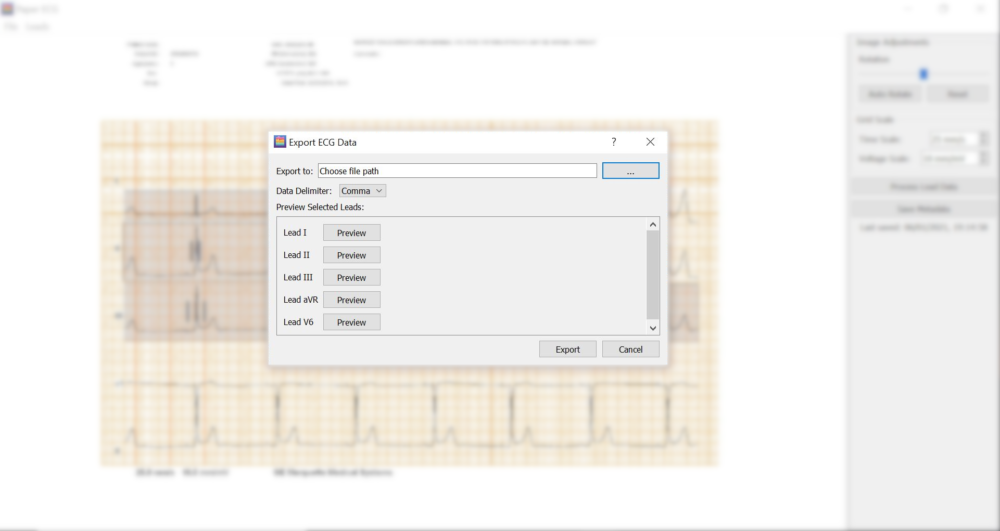
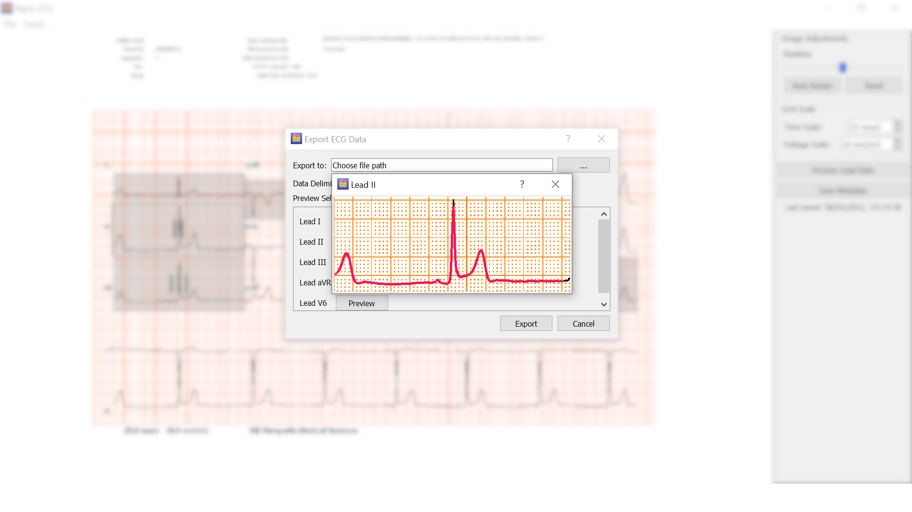
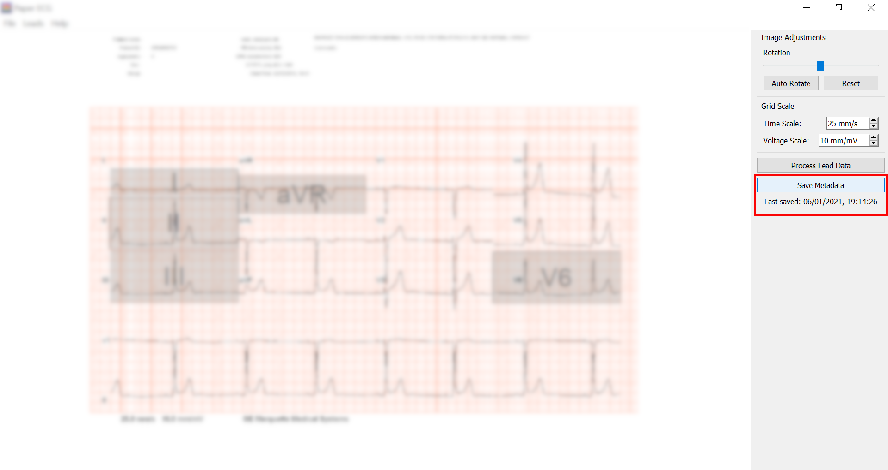
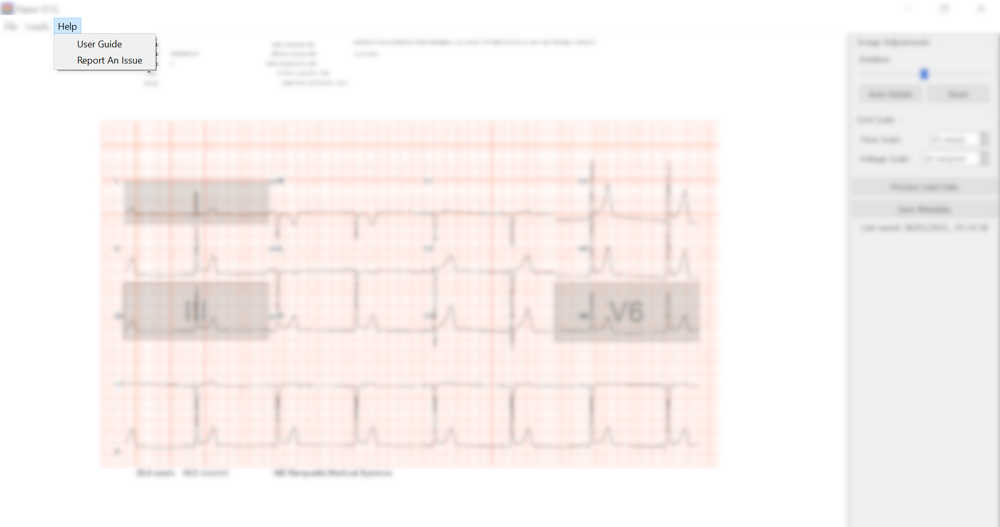

[Project Homepage](README.md) / User Guide

# How to digitize ECG scans with PaperECG #

This guide walks you through the process of digitizing ECG scans using the PaperECG application.

## Contents ##

- [Opening an ECG Scane Image](#Opening-an-ECG-Scan-Image)

- [Fixing Image Rotation](#Fixing-Image-Rotation)

- [Selecting Leads](#Selecting-Leads)

- [Adjusting Grid Scales](#Adjusting-Grid-Scales)

- [Exporting Signal Data](#Exporting-Signal-Data)

- [Saving Your Work](#Saving-Your-Work)

- [Getting Help](#Getting-Help)

## Opening an ECG Scan Image ##

The application supports JPG, PNG, and TIFF image formats. To open a new ECG scan, click the `File` button in the top left of the window and select `Open`. Alternatively, you can use the key shortcut `Ctrl + O`.

This will open a dialog where you may select your image from your file system as shown below. 

Once you select your image it will open in the application's editor window. You can zoom in and out of the image by pinching a track pad, scrolling with the wheel of a mouse, or by using the key shortcuts `Ctrl + Shift + +` (zoom in) and `Ctrl + -` (zoom out).

## Fixing Image Rotation ##

Digitization works best when the ECG scan is as straight as possible. If your image isn't perfectly aligned, you can fix the rotation using the slider on the control panel. 

## Selecting Leads ##
Once your image is loaded into the application, you may begin selecting leads to process. This involves wrapping a bounding box around each lead you want to process, attempting to minimize as much noise around it as possible.

To add a lead, click the `Lead` button in the menu bar at the top of the window, and select the name of the lead you wish to bound. Alternatively, you can use the key shortcuts listed alongside each button.

A new bounding box should now appear in the top left corner of the editor. Drag this box over the corresponding lead, ensuring you have the full signal. Try to exclude as much outside text and/or signals from the box to get the most accurate results.

When a lead bounding box is selected, it appears red, and the control panel on the side switches to a lead-specific view. Here, you will input the lead's start time. You also have the option to delete the lead if you no longer want to process it.

## Adjusting Grid Scales ##

To accurately scale the signal output, you need to enter the time scale (mm/s) and voltage scale (mm/mV) in the control panel as pictured below.

## Exporting Signal Data ##

Once you have selected your desired leads, set their start times, and adjusted the grid scales accordingly, you can digitize the signals by clicking the `Process Lead Data` button on the control panel. If the digitization was successful, the following dialog will pop up: 

Here, you must choose a file to export the signal data to. You can choose whether you want the data to be comma, tab, or space seperated using the `Data Delimeter` dropdown.

For visual validation, you can preview the extracted signals by clicking the `Preview` button for each lead. This shows the extracted signal (red) overlaying the original signal (black) as shown below. 

When you are ready to export, simply click the `Export` button at the bottom of the dialog and the data will be saved to your selected file.

## Saving Your Work ##

To saved your annotations for future reference, you can click the `Save Metadata` button on the control panel. This will save the current state of the application, so the next time you open the image you can pick up right where you left off.  

## Getting Help ##

If you run into trouble while using the application, check the `Help` tab in the menu bar. The `User Guide` button will link you back to this page. If you need to report a bug or would like to request a feature, click the `Report an Issue` button to be linked to our issues page on Github.

